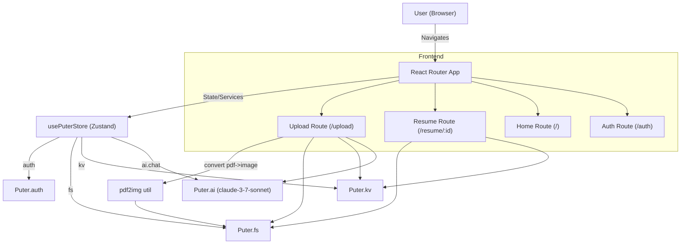
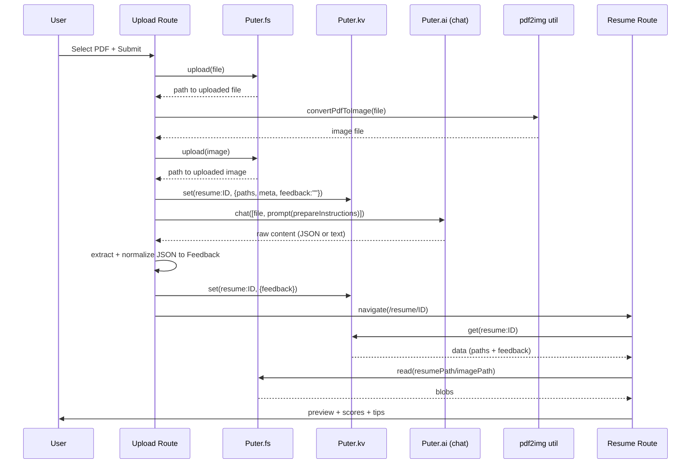

## Resumely — AI Resume Analyser (ATS assistant)

Resumely analyzes a candidate's resume against a target job using AI and produces an ATS-friendly breakdown with scores, tips, and improvement suggestions. Users can upload a PDF resume, the app converts it to an image for preview, requests AI feedback, normalizes the response into a consistent `Feedback` schema, and presents results in a clean UI.

### Key Features
- AI-powered resume analysis using Puter.ai chat (model: `claude-3-7-sonnet`).
- PDF upload with inline preview (PDF converted to image for quick viewing).
- Normalized, consistent feedback schema for display.
- Persistent storage using Puter KV for resume analysis history.
- Auth via Puter auth; quick profile menu with sign-in/out and "Wipe All".
- React Router 7 + TypeScript + TailwindCSS-based UI.

### Tech Stack
- Frontend: React, React Router 7, TypeScript, TailwindCSS
- State/Services: Zustand store wrapping Puter.js (`auth`, `fs`, `kv`, `ai`)
- AI: Puter.ai `chat` API with a strict prompt format
- File/Storage: Puter File System + KV store

## Project Structure

The most relevant files:
- `app/routes.ts`: routes map (`/`, `/auth`, `/upload`, `/resume/:id`, `/wipe`)
- `app/Lib/puter.ts`: Zustand store exposing `auth`, `fs`, `kv`, `ai` helpers
- `constants/index.ts`: `AIResponseFormat` and `prepareInstructions` (prompt)
- `app/routes/upload.tsx`: upload + analyze orchestration
- `app/routes/resume.tsx`: resume preview + feedback rendering
- `app/components/*`: UI components (`Summary`, `Details`, `ATS`, `ResumeCard`, etc.)
- `types/index.d.ts`: `Feedback`, `Resume`, etc. type contracts

## Architecture (Mermaid)



## Upload/Analyze Sequence (Mermaid)



## Feedback Schema

The app expects a `Feedback` object (see `types/index.d.ts`). At a high level:
- `overallScore: number`
- `ATS: { score: number, tips: { type: "good" | "improve"; tip: string }[] }`
- `toneAndStyle | content | structure | skills: { score: number, tips: { type; tip; explanation }[] }`

The analyzer prompt requests exactly this format. In `upload.tsx`, the code safely extracts JSON and normalizes alternative model responses into this schema.

## Getting Started

### Prerequisites
- Node.js 18+
- Access to Puter services (Puter.js is auto-loaded in `app/root.tsx`)

### Install
```bash
npm install
```

### Run (dev)
```bash
npm run dev
```
Visit `http://localhost:5173`.

### Build
```bash
npm run build
```

## Usage
1. Open the app and log in (profile menu or automatic redirect on protected routes).
2. Go to Upload, provide optional company/job context, and select a PDF.
3. The app uploads your PDF, converts it to an image, sends it to AI, and stores the analysis.
4. You are redirected to the Resume page to view the preview and detailed feedback.
5. Return to Home to see your analyzed resumes list.

### Data Management
- Use the profile menu (top-right) to "Wipe All" which clears uploaded files and KV entries.
- A legacy `Wipe` route (`/wipe`) also exists, but the profile menu action is the recommended path.

## Development Notes
- Prompt: `constants/index.ts` defines `AIResponseFormat` and `prepareInstructions`.
- AI model is set in `usePuterStore.ai.feedback` as `claude-3-7-sonnet`.
- JSON parsing in `app/routes/upload.tsx` includes code-fence stripping and normalization.
- Types are strict; run `npm run typecheck` for generation and TS checks.

## License
MIT — see `LICENSE`.